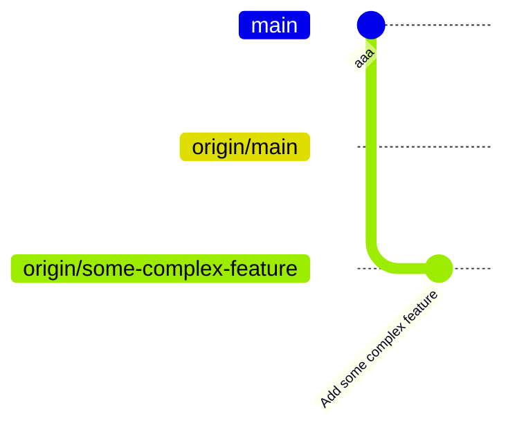
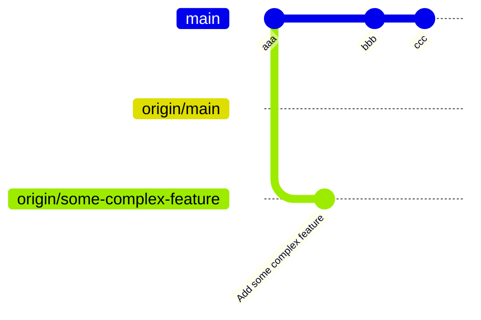
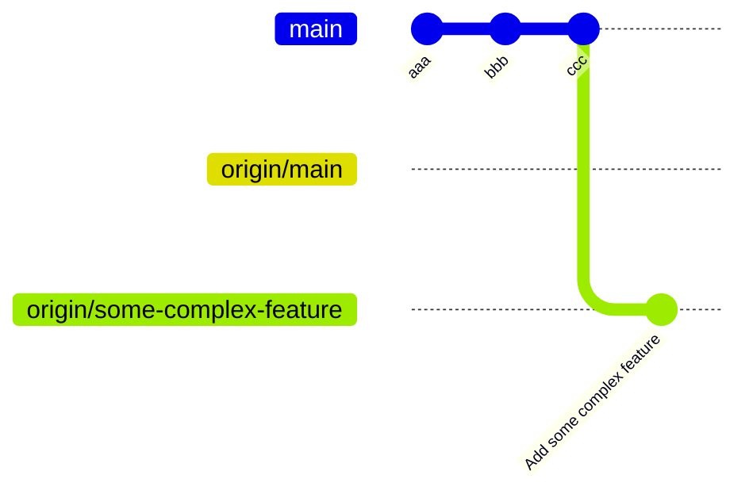

# Contributing to NativeLink

NativeLink welcomes contribution from everyone. Here are the guidelines if you
are thinking of helping us:

## Contributions

Contributions to NativeLink or its dependencies should be made in the form of
GitHub pull requests. Each pull request will be reviewed by a core contributor
(someone with permission to land patches) and either landed in the main tree or
given feedback for changes that would be required. All contributions should
follow this format, even those from core contributors.

Should you wish to work on an issue, please claim it first by commenting on
the GitHub issue that you want to work on it. This is to prevent duplicated
efforts from contributors on the same issue.

## Git setup

NativeLink has a somewhat specific contribution process to ensure consistent
quality across all commits. If anything in the following guide is unclear to you
please raise an issue so that we can clarify this document.

1. In your [GitHub settings](https://github.com/settings/keys), set up distinct
   authentication and signing keys. For further information see:
   - https://docs.github.com/en/authentication/connecting-to-github-with-ssh/generating-a-new-ssh-key-and-adding-it-to-the-ssh-agent
   - https://docs.github.com/en/authentication/connecting-to-github-with-ssh/adding-a-new-ssh-key-to-your-github-account

2. Fork the `TraceMachina/nativelink` repository by clicking on the `Fork`
   button.

3. Clone your fork:

   ```bash
   git clone git@github.com:yourusername/nativelink
   ```

> [!WARNING]
> Don't use
>
> ```bash
> git clone git@github.com:TraceMachina/nativelink
> ```

4. `cd` into the cloned repository:

   ```bash
   cd nativelink
   ```

5. Add `TraceMachina/nativelink` as a `remote` repository and call it
   `upstream`:

   ```bash
   git remote add upstream git@github.com:TraceMachina/nativelink
   ```

> [!TIP]
> To verify whether the setup was successful, run `git remote -v`. The output
> should look like this:
>
> ```bash
> origin   git@github.com:yourusername/nativelink (fetch)
> origin   git@github.com:yourusername/nativelink (push)
> upstream     git@github.com:TraceMachina/nativelink (fetch)
> upstream     git@github.com:TraceMachina/nativelink (push)
> ```

6. Finally, configure `git` to sign your commits with the keys you set up
   previously. Create a `.gitconfig` file in your home directory like so:

    ```ini
    [user]
         name = Your Full Name
         email = the-email-you-use-on-github@example.com
         signingkey = ~/.ssh/your_private_signing_key

    [gpg]
         format = ssh  # Or gpg if you use a GPG key.

    [commit]
         gpgsign = true

    [tag]
         gpgsign = true
    ```

## Local development setup

NativeLink ships almost all of its tooling in a nix flake which is configured
via a [`flake.nix`](https://github.com/tracemachina/nativelink/tree/main/flake.nix) file in the root of the repository. While it's
possible to work on some parts of the codebase without this environment, it'll
make your life much easier since it lets you reproduce most of CI locally.

1. Install Nix with flakes: https://github.com/NixOS/experimental-nix-installer
   For further information on Nix Flakes see: https://nixos.wiki/wiki/Flakes.
2. Optionally (but highly recommended), install [`direnv`](https://direnv.net/docs/installation.html) and
   hook it into your shell:

   ```bash
   nix profile install nixpkgs#direnv

   # Add the right hook for your shell: https://direnv.net/docs/hook.html

   # Restart your terminal.

   # When you `cd` into the nativelink repository, you should see a message
   # asking you to run `direnv allow`. Do this and you're good to go.
   ```

> [!NOTE]
> If you don't want to use `direnv`, you'll need to enter the flake manually
> with `nix develop` every time you enter the `nativelink` directory, switch
> branches or make changes to the nix files.

> [!TIP]
> To verify that the environment is active, run `env | grep NIX`. You should
> see several `*NIX_*` environment variables.

3. The environment doesn't ship a full C++ toolchain yet. Install a recent
   version of Clang manually:

   ```bash
   # Use your distros preferred package manager (pacman, emerge, apt etc), or
   # install via nix:
   nix profile install nixpkgs#clang
   ```

## Common workflows

These are some common workflows that you'll encounter during development on
NativeLink.

### Creating pull requests

NativeLink doesn't allow direct commits or human-created side branches in the
`TraceMachina/nativelink` repository. This holds for contributors in the
`TraceMachina` organization. To create a pull request:

1. Ensure that your personal fork is up-to-date with upstream:

   ```bash
   git switch main  # Switch to your local main branch
   git pull -r upstream main  # Fetch upstream and rebase your current branch
                              # against upstream's main branch
   git push  # Push your updated main to your own fork
   ```

> [!TIP]
> Use `git log` to check that your branches are in order:
>
> ```bash
> # A `git log` should look like this:
> commit ... (HEAD -> main, upstream/main, origin/main, origin/HEAD)
> ...
> ```

2. Create a new branch for the change you want to make:

   ```bash
   git switch -c some-feature
   ```

3. After making changes to the source code create a commit with `git commit`. To
   keep commits and the git history uniform and readable keep the following
   rules in mind:

   - Use a capital letter to start the commit and use an imperative tone for the
     title.
   - Don't end the title with a period.
   - Keep the first line as short as possible. If your feature is complex, add
     additional information in the commit message body.
   - If you feel like you need the word `and` in the commit title, the commit
     might try to do too many things at once and you should consider splitting
     it into separate commits.
   - The commit message body should have a maximum line length of 72 characters.
     This is to keep the `git log` readable with raw terminals.

   ```bash
   # Good.
   Add some feature

   # Bad - trailing period
   Add some feature.

   # Bad - not imperative
   Adds some feature

   # Bad - details should be in the body
   Add some complex feature and try to put all info in the title

   # Bad - commit should be split
   Add some feature and actually some other feature as well
   ```

4. Push your commit with `git push`. This will prompt you to set a remote branch
   for the commit:

   ```bash
   git push --set-upstream origin some-feature
   ```

5. Go to https://github.com/TraceMachina/nativelink/pulls where you should see a
   button that you can click to create to create a new pull request from your
   fork to the main repository.

6. Once you opened the pull request, click on the purple `Reviewable` button in
   the GitHub page for the pull request to add reviewers with `+@somereviewer`.

   The reviewers will take it from there and guide you through any potential
   remaining issues. Feel free to ask for help if you have trouble getting CI
   for your pull request green.

7. If you need to make additional changes, don't use a regular `git commit` on
   the pull request branch. Instead use `git commit --amend` and `git push -f`
   to update the commit in-place. The changes between the commit versions will
   remain visible in the Reviewable UI.

### Using `git rebase`

When you start working on a feature your `git log` looks something like this:



For complex features your commit might become outdated over time:



To get up-to-date with the latest branch, get the latest upstream commit and
rebase your branch onto the new `main` branch:

```bash
git switch main                 # Switch to the origin/main branch
git pull -r upstream main       # Sync the local main branch with upstream/main
git push                        # Push the new local main to origin/main
git switch some-complex-feature # Go back to the feature branch
git rebase main                 # Rebase the feature branch onto the local main
git push -f                     # Update the PR on GitHub
```

After this the history will be fine again:



### Fixing rust formatting

When working on Rust code `bazel test` commands automatically run `rustfmt` on
all source files. If you get errors from these checks, run the `rustfmt` Bazel
target to format the sources.

```bash
bazel run --config=rustfmt @rules_rust//:rustfmt
```

### Running pre-commit hooks

Ensure you're in the Nix development environment as described in the [Local Development Setup](#local-development-setup).
To run the hooks:

```bash
pre-commit run -a
```

This will automatically apply some fixes like automated line fixes and format
changes. Note that changed files aren't automatically staged. Use `git add` to
add the changed files manually to the staging area.

### Setting up rust-analyzer

[rust-analyzer](https://rust-analyzer.github.io/) works reasonably well out of the box due to picking up the manifest for the `nativelink` crate, but it isn't integrated with Bazel by default. In order to generate a project configuration for rust-analyzer,
run the `@rules_rust//tools/rust_analyzer:gen_rust_project` target:

```sh
bazel run @rules_rust//tools/rust_analyzer:gen_rust_project
```

This will generate a `rust-project.json` file in the root directory. This file needs to be regenerated every time new files or dependencies are added in order to stay up-to-date. You can configure rust-analyzer can pick it up by setting the [`rust-analyzer.linkedProjects`](https://rust-analyzer.github.io/manual.html#rust-analyzer.linkedProjects) [configuration option](https://rust-analyzer.github.io/manual.html#configuration).

If you use VS Code, you can configure the following `tasks.json` file to automatically generate this file when you open the editor:

```jsonc
{
  "version": "2.0.0",
  "tasks": [
    {
      "label": "Generate rust-project.json",
      "command": "bazel",
      "args": ["run", "@rules_rust//tools/rust_analyzer:gen_rust_project"],
      "options": {
        "cwd": "${workspaceFolder}"
      },
      "group": "build",
      "problemMatcher": [],
      "presentation": {
        "reveal": "never",
        "panel": "dedicated"
      },
      "runOptions": {
        "runOn": "folderOpen"
      },
      "dependsOn": "Build nativelink"
    },
    {
      "label": "Build nativelink",
      "command": "bazel",
      "args": ["build", "//:nativelink"],
      "options": {
        "cwd": "${workspaceFolder}"
      },
      "group": "build",
      "presentation": {
        "reveal": "silent",
        "panel": "shared"
      }
    }
  ]
}
```

And to configure rust-analyzer to use that project, set this in your `.vscode/settings.json`:

```jsonc
{
     "rust-analyzer.linkedProjects": ["rust-project.json"]
}
```

## Generating documentation

Automatically generated documentation is still under construction. To view the
documentation for the `nativelink-*` crates, run the `docs` command in the nix
flake:

```bash
docs
```

To build individual crate-level docs:

```bash
# All docs
bazel build docs

# A single crate
bazel build nativelink-config:docs
```

To run documentation tests with Bazel:

```bash
bazel test doctests
```

## Writing documentation

NativeLink largely follows the [Microsoft Style Guide](https://learn.microsoft.com/en-us/style-guide/welcome/).

NativeLink implements its documentation style guide via Vale. The pre-commit
hooks forbid errors but permit warnings and suggestions. To view all of Vale's
suggestions invoke it directly:

```bash
vale somefile
```

## Creating releases

To keep the release process in line with best practices for open source
repositories, not all steps are automated. Specifically, tags should be signed
and pushed manually and the release notes should be human readable beyond what
most automatically generated changelogs provide.

1. Bump the current version in the following files:

   - `MODULE.bazel`
   - `Cargo.toml`
   - `nativelink-*/Cargo.toml`

2. Run `git cliff --tag=0.x.y > CHANGELOG.md` to update the changelog. You might
   need to make manual adjustments to `cliff.toml` if `git-cliff` doesn't put a
   commit in the right subsection.

3. Create the commit and PR. Call it `Release NativeLink v0.x.y`.

4. Once the PR is merged, update your local repository and origin:

   ```bash
   git switch main
   git pull -r upstream main
   git push
   ```

5. Create a **signed** tag on the release commit and give it the same tag
   message as the name of the tag. This tag should be the version number with a
   `v` prefix:

   ```bash
   git tag -s v0.x.y

   # tag message should be: v0.x.y
   ```

6. Push the signed tag to the origin repository:

   ```bash
   git push origin v0.x.y
   ```

7. Pushing the tag triggers an additional GHA workflow which should create the
   container images in your own fork. Check that this workflow is functional. If
   the CI job in your fork passes, push the tag to upstream:

   ```bash
   git push upstream v0.x.y
   ```

8. The images for the release are now being created. Go to the [Tags](https://github.com/TraceMachina/nativelink/tags)
   tab in GitHub and double-check that the tag has a green `Verified` marker
   next to it. If it does, select `Create a release from tag` and create release
   notes. You can use previous release notes as template by clicking on the
   "Edit" button on a previous release and copy-pasting the contents into the
   new release notes.

   Make sure to include migration instructions for all breaking changes.

   Explicitly list whatever changes you think are worth mentioning as `Major
   changes`. This is a fairly free-form section that doesn't have any explicit
   requirements other than being a best-effort summary of notable changes.

9. Once all notes are in line, click `Publish Release`.

## Conduct

NativeLink Code of Conduct is available in the
[CODE_OF_CONDUCT](https://github.com/tracemachina/nativelink/tree/main/CODE_OF_CONDUCT.md) file.

## Generating code coverage

You can generate branch-based coverage reports via:

```
nix build .#nativelinkCoverageForHost
```

The `result` symlink contains a webpage with the visualized report.

## Independent benchmarks

The third-party repository [skyrpex/nativelink-benchmarks](https://github.com/skyrpex/nativelink-benchmarks) is a project that gathers benchmarking data for every commit in NativeLink.

You can view the benchmark data evolution over time at [https://nativelink-benchmarks.vercel.app/](https://nativelink-benchmarks.vercel.app/).
