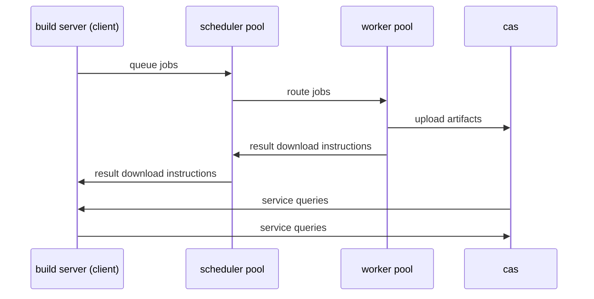

# NativeLink

[](https://opensource.org/licenses/Apache-2.0)
[](https://securityscorecards.dev/viewer/?uri=github.com/TraceMachina/nativelink)
[](https://www.bestpractices.dev/projects/8050)
[](https://nativelink.slack.com/join/shared_invite/zt-281qk1ho0-krT7HfTUIYfQMdwflRuq7A#/shared-invite/email)

NativeLink is an extremely (blazingly?) fast and efficient build cache and
remote executor for systems that communicate using the [Remote execution
protocol](https://github.com/bazelbuild/remote-apis/blob/main/build/bazel/remote/execution/v2/remote_execution.proto) such as [Bazel](https://bazel.build), [Buck2](https://buck2.build), [Goma](https://chromium.googlesource.com/infra/goma/client/) and
[Reclient](https://github.com/bazelbuild/reclient). NativeLink powers over one billion requests per month for customers using the system for their  production workloads.

Supports Unix-based operating systems and Windows.

## Getting Started with NativeLink

Below, you will find a few different options for getting started with NativeLink.

## 🚀 Example Deployments

You can find a few example deployments in the [deployment-examples directory](./deployment-examples).

### 📝 Clone the NativeLink repository
1. Go to the [NativeLink](https://github.com/TraceMachina/nativelink) repository on GitHub. Clone the repository via SSH or HTTPS. In this example the repository is cloned via SSH:
```bash
git clone git@github.com:TraceMachina/nativelink.git
```

### 📦 Installing with Cargo

1. First install Rust, but skip to step 2 if you have it already.
```bash
curl --proto '=https' --tlsv1.2 -sSf https://sh.rustup.rs | sh
```
2. Install NativeLink with Cargo.
```bash
cargo install --git https://github.com/TraceMachina/nativelink --tag v0.4.0
```

### ⚙️ Configure and 🦾 Start NativeLink

The `nativelink` executable reads a JSON file as it's only parameter,
`--config`. See [`nativelink-config`](./nativelink-config/examples/basic_cas.json)
for more details and examples.

To grab the example in your current working directory, run:

```bash
curl -O https://raw.githubusercontent.com/TraceMachina/nativelink/main/nativelink-config/examples/basic_cas.json

### you can modify the example above to replace the filesystem store with the memory store if you favor speed over data durability.
nativelink basic_cas.json
```

## 🧪 Evaluating NativeLink

1. Once you've built NativeLink and have an instance running with the `basic_cas.json` configuration, launch a separate terminal session.
2. Navigate to where you cloned the NativeLink repository:
```bash
cd $HOME/nativelink
```
3. In the new terminal, run the following command to connect the running server launched above to Bazel or another RBE client:

```sh
bazel test //... \
  --remote_instance_name=main \
  --remote_cache=grpc://127.0.0.1:50051 \
  --remote_executor=grpc://127.0.0.1:50051 \
  --remote_default_exec_properties=cpu_count=1
```

For Windows PowerShell;

```powershell
bazel test //... `
  --remote_instance_name=main `
  --remote_cache=grpc://127.0.0.1:50051 `
  --remote_executor=grpc://127.0.0.1:50051 `
  --remote_default_exec_properties=cpu_count=1
```
This causes Bazel to run the commands through an all-in-one `CAS`, `scheduler`
and `worker`.

> [!WARNING]
> If you're using MacOS, encountering errors is anticipated at this stage. Our team is actively working on enhancing support for executing remoteable Bazel builds with MacOS. For now, you can run with [Docker](https://github.com/blakehatch/nativelink/tree/main/deployment-examples/docker-compose) or a Linux virtual machine. If you have any questions, reach out on the [NativeLink](https://join.slack.com/t/nativelink/shared_invite/zt-2forhp5n9-L7dTD21nCSY9_IRteQvZmw) slack.

## How it Works

This diagram is a high-level overview of the data flow in the NativeLink system. It refers to NativeLink concepts like Scheduler pool, Worker pool, and CAS rather than the cloud concepts like functions, compute nodes, and object storage to which they correspond.


## ❄️ Installing with Nix

**Installation requirements:**

* Nix with [flakes](https://nixos.wiki/wiki/Flakes) enabled

This build doesn't require cloning the repository, but you need to provide a
configuration file, for instance the one at [`nativelink-config/examples/basic_cas.json`](./nativelink-config/examples/basic_cas.json).

The following command builds and runs NativeLink in release (optimized) mode:

```sh
nix run github:TraceMachina/nativelink ./basic_cas.json
```

For use in production pin the executable to a specific revision:

```sh
nix run github:TraceMachina/nativelink/<revision> ./basic_cas.json
```

## 🌱 Building with Bazel

**Build requirements:**

* Bazel `7.0.2`
* A recent C++ toolchain with LLD as linker

> [!TIP]
> This build supports Nix/direnv which provides Bazel but no C++ toolchain
> (yet).

The following commands places an executable in `./bazel-bin/nativelink` and
starts the service:

```sh
# Unoptimized development build on Unix
bazel run nativelink -- $(pwd)/nativelink-config/examples/basic_cas.json

# Optimized release build on Unix
bazel run -c opt nativelink -- $(pwd)/nativelink-config/examples/basic_cas.json

# Unoptimized development build on Windows
bazel run --config=windows nativelink -- $(pwd)/nativelink-config/examples/basic_cas.json

# Optimized release build on Windows
bazel run --config=windows -c opt nativelink -- $(pwd)/nativelink-config/examples/basic_cas.json
```

> [!WARNING]
> The Rust compiler `rustc` generates numerous artifacts during compilation,
> including dependencies, macros, and intermediate files.
> When compiling programs from source, be mindful of the associated files'
> impact on your disk usage in the `bazel-bin/` directory.
> This directory can grow substantially in size.
>
> If the facing issues due to this, run the following command
> to clear cache files:
> ```sh
> bazel clean --expunge
> ```

## 📦 Building with Cargo

**Build requirements:**

* Cargo 1.74.0+
* A recent C++ toolchain with LLD as linker

> [!TIP]
> This build supports Nix/direnv which provides Cargo but no C++
> toolchain/stdenv (yet).

```bash
# Unoptimized development build
cargo run --bin nativelink -- ./nativelink-config/examples/basic_cas.json

# Optimized release build
cargo run --release --bin nativelink -- ./nativelink-config/examples/basic_cas.json
```

> [!WARNING]
> The Rust compiler `rustc` generates numerous artifacts during compilation,
> including dependencies, macros, and intermediate files.
> When compiling programs from source, be mindful of the associated files'
> impact on your disk usage in the target/ directory.
> This directory can grow substantially in size.
>
> If the facing issues due to this, run the following command
> to clear cache files:
> ```sh
> cargo clean
> ```

## Project Health

* Powering more than 1 billion devices at the edge.

## 🏺 History

This project was first created due to frustration with similar projects not
working or being extremely inefficient. Rust was chosen as the language to write
it in because at the time Rust was going through a revolution in the new-ish
feature `async-await`. This made making multi-threading simpler when
paired with a runtime like [Tokio](https://github.com/tokio-rs/tokio) while
still giving all the lifetime and other protections that Rust gives. This pretty
much guarantees that we will never have crashes due to race conditions. This
kind of project seemed perfect, since there is so much asynchronous activity
happening and running them on different threads is most preferable. Other
languages like `Go` are good candidates, but other similar projects rely heavily
on channels and mutex locks which are cumbersome and have to be carefully
designed by the developer. Rust doesn't have these issues, since the compiler
will always tell you when the code you are writing might introduce undefined
behavior. The last major reason is because Rust is extremely fast and has no
garbage collection (like C++, but unlike `Java`, `Go`, or `Typescript`).

## 📜 License

Copyright 2020–2024 Trace Machina, Inc.

Licensed under the Apache 2.0 License, SPDX identifier `Apache-2.0`.
