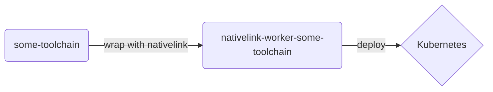
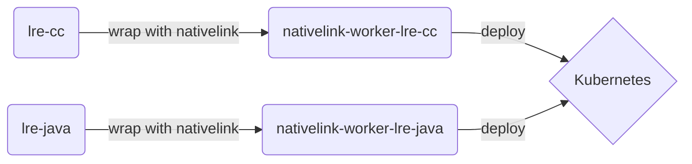
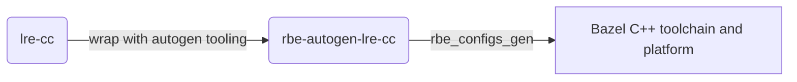

# Local Remote Execution

[](https://www.youtube.com/embed/uokjTev8myk?rel=0)

NativeLink's Local Remote Execution is a framework to build, distribute, and
rapidly iterate on custom toolchain setups that are transparent, fully hermetic,
and reproducible across machines of the same system architecture.

Local Remote Execution mirrors toolchains for remote execution in your local
development environment. This lets you reuse build artifacts with virtually
perfect cache hit rate across different repositories, developers, and CI.

> [!WARNING]
> LRE highly experimental and can be challenging to set up in downstream
> projects. Please reach out on the [NativeLink](https://join.slack.com/t/nativelink/shared_invite/zt-2forhp5n9-L7dTD21nCSY9_IRteQvZmw)
> Slack if you have any questions or ideas for improvement.

> [!NOTE]
> At the moment LRE only works on `x86_64-linux`.

## Pre-Requisites

- Nix 2.19.0 or later
- A functional local container setup

## ❄️ Flake-side setup

Your project must have a Nix flake and use [flake-parts](https://github.com/hercules-ci/flake-parts).

Add the `nativelink` repository to your flake inputs and make the `nixpkgs` from
`nativelink` the global input for your project:

```nix
inputs = {
  nixpkgs = {
    url = "github:nixos/nixpkgs";

    # IMPORTANT: This needs to follow the `nixpkgs` from nativelink so that
    # the local LRE toolchains are in sync with the remote toolchains.
    follows = "nativelink/nixpkgs";
  };
  nativelink = {
    # This repository provides the autogenerated LRE toolchains which are
    # dependent on the nixpkgs version in the nativelink repository. To keep the
    # local LRE toolchains aligned with remote LRE, we need to use the nixpkgs
    # used by nativelink as the the "global" nixpkgs. We do this by setting
    # `nixpkgs.follows = "nativelink/nixpkgs"` above.

    # Keep this commit in sync with the LRE commit that you import via Bazel.
    url = "github:TraceMachina/nativelink/64ed20a40964b8c606c7d65f76af840bcfc837fd";
  };
  # ...
};
```

Then, in your `flake-parts` imports, add the `nativelink` flake module:

```nix
imports = [
  inputs.nativelink.flakeModule
];
```

Finally, add the `lre.bazelrc` generator in your `devShell`'s `shellHook`:

```nix
devShells.default = pkgs.mkShell {
  # ...
  shellHook = ''
    # Generate lre.bazelrc which configures LRE toolchains when running
    # in the nix environment.
    ${config.local-remote-execution.installationScript}
  '';
}
```

Now, when you enter the nix flake (automated via `direnv` or manually via
`nix develop`) it will generate a file called `lre.bazelrc` which contains
information about the LRE toolchain and configures Bazel. With the default
configuration it looks like this:

```bash
# These flags are dynamically generated by the LRE flake module.
#
# Add `try-import %workspace%/lre.bazelrc` to your .bazelrc to
# include these flags when running Bazel in a nix environment.

# These are the paths used by your local LRE config. If you get cache misses
# between local and remote execution, double-check these values against the
# toolchain configs in the `@local-remote-execution` repository at the
# commit that you imported in your `MODULE.bazel`.
#
# WARNING: No environment set. LRE will not work locally.

# Bazel-side configuration for LRE.
build --action_env=BAZEL_DO_NOT_DETECT_CPP_TOOLCHAIN=1
build --define=EXECUTOR=remote
build --extra_execution_platforms=@local-remote-execution//generated-cc/config:platform
build --extra_toolchains=@local-remote-execution//generated-cc/config:cc-toolchain
```

In the snippet above you can see a warning that no local toolchain is
configured. LRE needs to know the remote toolchain configuration to make it
available locally. The `local-remote-execution` settings take an `Env` input and
an optional `prefix` input to configure the generated `lre.bazelrc`:

```nix
# This is a top-level field, next to `packages` and `apps`, and `devShells`
local-remote-execution.settings = {
  # In this example we import the lre-cc environment from nativelink and make it
  # available locally.
  inherit (lre-cc.meta) Env;

  # This causes the `build` commands in the `lre.bazelrc` to be prefixed with
  # `lre` so that LRE is disabled by default and may be enabled by passing
  # `--config=lre` to a Bazel build.
  prefix = "lre";
};
```

Exit and re-enter the flake. The `lre.bazelrc` should look now like this:

```bash
# These flags are dynamically generated by the LRE flake module.
#
# Add `try-import %workspace%/lre.bazelrc` to your .bazelrc to
# include these flags when running Bazel in a nix environment.

# These are the paths used by your local LRE config. If you get cache misses
# between local and remote execution, double-check these values against the
# toolchain configs in the `@local-remote-execution` repository at the
# commit that you imported in your `MODULE.bazel`.
#
# PATH=/nix/store/lr2xhk791gy0lfwk4g5954kd8yfqsbsl-binutils-wrapper-2.41/bin:/nix/store/29xdc6ax5g41njf20h09gmf52qm1zws6-customClang/bin:/nix/store/kwlg5k0zmnkkj3p2kzi3b49sj73887j4-stdenv-linux/bin:/nix/store/asqa3kfq3maclk7cqqhrjvp7vriw6ahy-coreutils-9.5/bin:/nix/store/vf8cjkgwmgd4sb3vkxh6x9iar71s1w1c-findutils-4.9.0/bin:/nix/store/zs4ajc6bp81c92fj2l5r2d68ra0hmfbb-gnutar-1.35/bin
# CC=/nix/store/29xdc6ax5g41njf20h09gmf52qm1zws6-customClang/bin/customClang
# BAZEL_LINKOPTS=-L/nix/store/z56vdnayhj4v4s7g4rsg9b1jkpdblk91-libcxx-18.1.3/lib:-L/nix/store/1jvrjkymv56pbva6hfsbdavf8h44dn1g-libunwind-18.1.3/lib:-lc++:-Wl,-rpath,/nix/store/z56vdnayhj4v4s7g4rsg9b1jkpdblk91-libcxx-18.1.3/lib,-rpath,/nix/store/1jvrjkymv56pbva6hfsbdavf8h44dn1g-libunwind-18.1.3/lib,-rpath,/nix/store/35pq4hr29c3sl79lgfwgsvd9nwzyp4am-glibc-2.39-5/lib

# Bazel-side configuration for LRE.
build:lre --action_env=BAZEL_DO_NOT_DETECT_CPP_TOOLCHAIN=1
build:lre --define=EXECUTOR=remote
build:lre --extra_execution_platforms=@local-remote-execution//generated-cc/config:platform
build:lre --extra_toolchains=@local-remote-execution//generated-cc/config:cc-toolchain
```

The commented paths created in `lre.bazelrc` technically have no effect on what
Bazel's toolchain creates, but for nix to be able to generate the store paths
it needs to fetch the files to your local system. In other words, all paths
printed in `lre.bazelrc` will be available on your local system.

Let's move on to Bazel's configuration.

## 🌱 Bazel-side setup

First, hook the generated `lre.bazelrc` into the main `.bazelrc` with a
`try-import`:

```bash
# In your .bazelrc

# Generated by the LRE flake module.
try-import %workspace%/lre.bazelrc
```

Recall that the `lre.bazelrc` file contains lines like this:

```bash
build:lre --extra_execution_platforms=@local-remote-execution//generated-cc/config:platform
build:lre --extra_toolchains=@local-remote-execution//generated-cc/config:cc-toolchain
```

The `@local-remote-execution` Bazel module contains the Bazel-side configuration
of the LRE toolchain. If you view [`generated-cc/cc/BUILD`](https://github.com/tracemachina/nativelink/tree/main/local-remote-execution/generated-cc/cc/BUILD)
you should find the same `/nix/store/...` paths as in the `lre.bazelrc` file.

Now import the LRE toolchains in your `MODULE.bazel` to make the
`@local-remote-execution` Bazel module available to your build:

```python
# In your MODULE.bazel

bazel_dep(name = "local-remote-execution", version = "0")
git_override(
    module_name = "local-remote-execution",
    remote = "https://github.com/TraceMachina/nativelink",
    strip_prefix = "nativelink",

    # Keep this commit in sync with the one in `flake.nix`.
    commit = "64ed20a40964b8c606c7d65f76af840bcfc837fd",
)
```

Let's use NativeLink's Kubernetes example to verify that the setup worked.

## 🚢 Testing with local K8s

Start the cluster and set up NativeLink in an LRE configuration. For details on
this refer to the [Kubernetes example](https://github.com/tracemachina/nativelink/tree/main/deployment-examples/kubernetes):

> [!TIP]
> NativeLink's `native` CLI tool is self-contained and can be imported into
> other nix flakes by adding `inputs.nativelink.packages.${system}.native-cli`
> to the `nativeBuildInputs` of your `devShell`.

```bash
#!/usr/bin/env bash

set -xeuo pipefail

native up

# Wait for gateways to come online.
sleep 20

EVENTLISTENER=$(kubectl get gtw eventlistener -o=jsonpath='{.status.addresses[0].value}')

# Note: Keep this in sync with the commit in `flake.nix` and `MODULE.bazel`.
NATIVELINK_COMMIT=64ed20a40964b8c606c7d65f76af840bcfc837fd

curl -v \
    -H 'Content-Type: application/json' \
    -d '{
        "flakeOutput": "github:TraceMachina/nativelink/'"${NATIVELINK_COMMIT}"'#image"
    }' \
    http://"${EVENTLISTENER}":8080

curl -v \
    -H 'Content-Type: application/json' \
    -d '{
        "flakeOutput": "github:TraceMachina/nativelink/'"${NATIVELINK_COMMIT}"'#nativelink-worker-lre-cc"
    }' \
    http://"${EVENTLISTENER}":8080

# Wait for the pipelines to finish.
sleep 1 && kubectl wait \
    --for=condition=Succeeded \
    --timeout=45m \
    pipelinerun \
        -l tekton.dev/pipeline=rebuild-nativelink

KUSTOMIZE_DIR=$(git rev-parse --show-toplevel)
cat <<EOF > "$KUSTOMIZE_DIR"/kustomization.yaml
---
apiVersion: kustomize.config.k8s.io/v1beta1
kind: Kustomization
bases:

resources:
  - https://github.com/TraceMachina/nativelink//deployment-examples/kubernetes/base
  - https://raw.githubusercontent.com/TraceMachina/nativelink/main/deployment-examples/kubernetes/worker-lre-cc.yaml
EOF


cd "$KUSTOMIZE_DIR" && kustomize edit set image \
    nativelink=localhost:5001/nativelink:"$(nix eval\
        github:TraceMachina/nativelink/${NATIVELINK_COMMIT}#image.imageTag --raw)" \
    nativelink-worker-lre-cc=localhost:5001/nativelink-worker-lre-cc:"$(nix eval\
        github:TraceMachina/nativelink/${NATIVELINK_COMMIT}#nativelink-worker-lre-cc.imageTag --raw)"

kubectl apply -k "$KUSTOMIZE_DIR"

kubectl rollout status deploy/nativelink-cas
kubectl rollout status deploy/nativelink-scheduler
kubectl rollout status deploy/nativelink-worker-lre-cc
```

Wait until the cluster is running and the NativeLink deployments are ready. Then
invoke a build against the cluster:

```bash
CACHE=$(kubectl get gtw cache -o=jsonpath='{.status.addresses[0].value}')
SCHEDULER=$(kubectl get gtw scheduler -o=jsonpath='{.status.addresses[0].value}')

# Note: If you omit setting a `prefix` the `local-remote-execution.settings` you
#       can omit `--config=lre` here as LRE will be enabled by default.
bazel build \
    --config=lre \
    --remote_instance_name=main \
    --remote_cache=grpc://$CACHE:50051 \
    --remote_executor=grpc://$SCHEDULER:50052 \
    //local-remote-execution/examples:lre-cc
```

The target builds remotely:

```bash
INFO: Found 1 target...
Target //local-remote-execution/examples:lre-cc up-to-date:
  bazel-bin/local-remote-execution/examples/lre-cc
INFO: Elapsed time: 3.004s, Critical Path: 2.23s
INFO: 11 processes: 9 internal, <<<2 remote>>>.
INFO: Build completed successfully, 11 total actions
```

Now let's disable remote execution and attempt a local rebuild, but keep access
to the remote cache:

```bash
# Clear up any local results.
bazel clean

CACHE=$(kubectl get gtw cache -o=jsonpath='{.status.addresses[0].value}')

# Note: If you omit setting a `prefix` the `local-remote-execution.settings` you
#       can omit `--config=lre` here as LRE will be enabled by default.
bazel build \
    --config=lre \
    --remote_instance_name=main \
    --remote_cache=grpc://$CACHE:50051 \
    //local-remote-execution/examples:lre-cc
```

You'll get a cache hit on the target despite using a local build:

```bash
INFO: Analyzed target //local-remote-execution/examples:lre-cc (91 packages loaded, 1059 targets configured).
INFO: Found 1 target...
Target //local-remote-execution/examples:lre-cc up-to-date:
  bazel-bin/local-remote-execution/examples/lre-cc
INFO: Elapsed time: 0.767s, Critical Path: 0.18s
INFO: 11 processes: <<<2 remote cache hit>>>, 9 internal.
INFO: Build completed successfully, 11 total actions
```

> [!TIP]
> You can also do this the other way around, that is, run a local build and
> upload artifacts to the remote cache and have a remote build reuse those
> artifacts. Or you can only run local builds on different machines that all
> share the same cache.
>
> If you set up all your projects to use the same LRE configuration you'll be
> able to reuse caches for the common dependencies of your projects.

## 🛠️ Rebuilding the toolchains

This is only relevant if you're updating the base toolchains in the `nativelink`
repository itself. If you run `nix flake update` in the `nativelink` repository
you need to update the generated Bazel toolchains as well:

```bash
generate-toolchains
```

## 📐 Architecture

The original C++ and Java toolchain containers are never really instantiated.
Instead, their container environments are used and passed through transforming
functions that take a container schematic as input and generate some other
output.

The first transform is the [`createWorker`](https://github.com/tracemachina/nativelink/tree/main/tools/create-worker.nix) wrapper
which converts an arbitrary OCI image to a NativeLink worker:



In the case of LRE the base image is built with Nix for perfect reproducibility.
However, you could use a more classic toolchain container like an Ubuntu base
image as well:



The second transform is some mechanism that generates toolchain configurations
for your respective RBE client:


In many classic setups the RBE client configurations are handwritten. In the
case of LRE we're generating Bazel toolchains and platforms using a pipeline of
custom image generators and the `rbe_configs_gen` tool:



When you then invoke your RBE client with the configuration set up to use these
toolchains, the NativeLink scheduler matches actions to the worker they require.

In Bazel's case this scheduler endpoint is set via the `--remote_executor` flag.

## 🦜 Custom toolchains

The general approach described works for arbitrary toolchain containers. You
might need to implement your own logic to get from the toolchain container to
some usable RBE configuration files (or write them manually), but this can be
considered an implementation detail specific to your requirements.

TODO(aaronmondal): Add an example of a custom toolchain extension around lre-cc.


