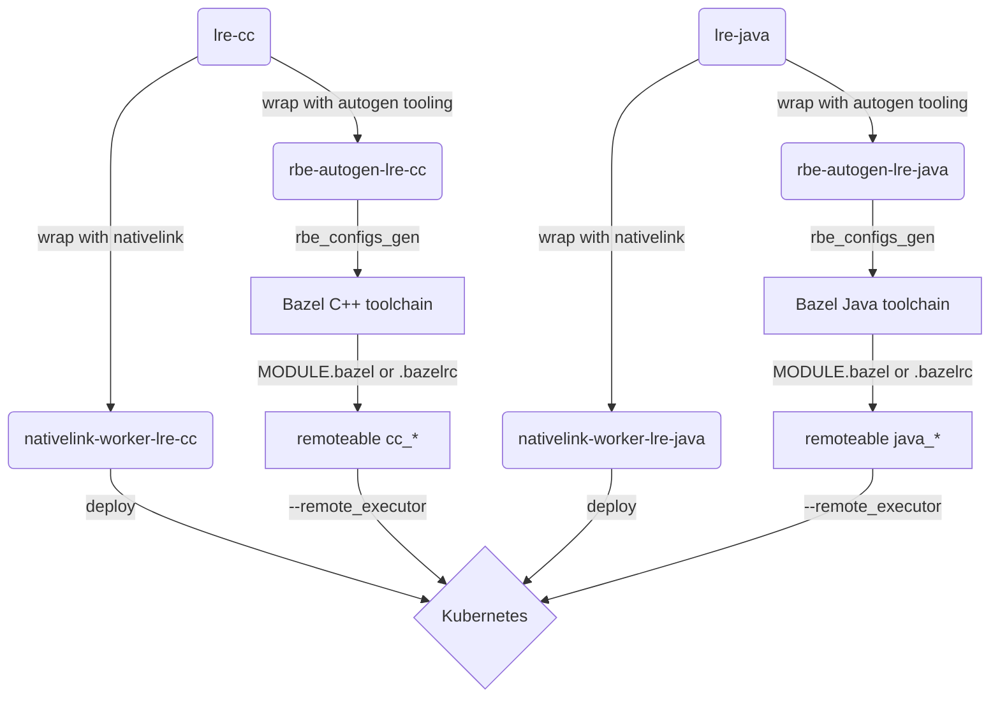

# Local Remote Execution

NativeLink's Local Remote Execution is a framework to build and rapidly iterate
custom toolchain setups that are transparent, fully hermetic and reproducible
across machines of the same system architecture. When used in conjunction with
Nix, Local Remote Execution recreates the remote execution toolchain in your
local development environment. Working with LRE lets you seamlessly switch
between remote and local builds while reusing the same cache.

You must clone the repository to use Local Remote Execution. Other than that,
there are few pre-requisistes.

## Pre-Requisites

- Nix 2.19.0 or later
- A functional local container setup

## Setting up Local Remote Execution

> [!Note]
> Local Remote Execution has only been tested on `x86_64-linux`.

1. Enable a [Flake-based](https://nixos.wiki/wiki/Development_environment_with_nix-shell)
Nix Shell within the NativeLink root directory.

```bash
nix develop
```
2. Generate the LRE [OCI images](https://opencontainers.org/) containing the
toolchains:

```bash
generate-toolchains
```

You should see terminal output beginning with:

```bash
++ git rev-parse --show-toplevel
```

The [`generate-toolchains`](../tools/generate-toolchains.nix) command creates
OCI images from the [lre-cc](./lre-cc.nix) and [lre-java](./lre-java.nix) images
and generates toolchain configurations from it. The resulting generated [C++ toolchains](./generated/cc/BUILD)
and [Java toolchains](./generated-java/java/BUILD) have their dependencies
pinned to specific derivations in `/nix/store/*`. These paths mirror the ones
that you fetched when entering the flake development environment, that is, the
tools in the container and in your local environment are the same.

3. You can now build targets with the generated toolchain configurations. To
build the `hello_lre` target in the [examples](./examples/) directory:

```bash
bazel run --config=lre @local-remote-execution//examples:hello_lre
```

🎉 That's it! You've built a target with Local Remote Execution using NativeLink. 🎉

## Switching to Remote Execution

If you have the remote execution container deployed as a worker you can switch
to remote execution. For instance when using the [Kubernetes example](../deployment-examples/kubernetes):

```bash
bazel run \
    --config=lre \
    --remote_cache=grpc://172.20.255.200:50051 \
    --strategy_regexp .*=remote \
    --remote_executor=grpc://172.20.255.201:50052 \
    @local-remote-execution//examples:hello_lre
```

## Architecture

The original C++ and Java toolchain containers are never really instantiated.
Instead, their container environments are used and passed through transforming
functions that take a container schematic as input and generate some other
output. In the case of C++ and Java the generator is the
[`rbe_configs_gen`](https://github.com/bazelbuild/bazel-toolchains/tree/master)
tool which makes these toolchains particularly straightforward to create:


