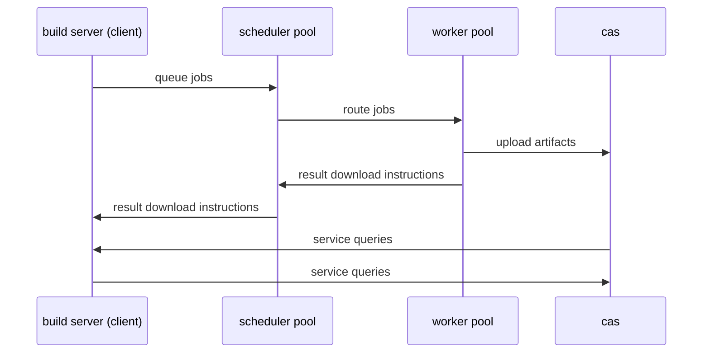

This diagram presents a high-level overview of data flow in NativeLink.

1. The `client` such as Bazel, Buck2 or Reclient creates a job and sends it to
   the `scheduler`'s job queue.
2. The `scheduler` finds a suitable worker in the worker pool and routes the job
   to it.
3. The `worker` runs the job, sending output artifacts to the `cas`.
4. The `worker` provides download instructions for the artifact to the
   `scheduler`.
5. The `scheduler` forwards the download instructions to the `client`.

In conclusion, the client created a job and sent it to NativeLink and gets a
response that lets it download the built artifact.
